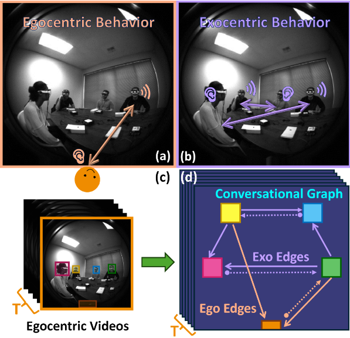

# The Audio-Visual Conversational Graph: from an Egocentric-Exocentric Perspective (CVPR 2024)
This is a third-party implementation of CVPR 2024 paper [The Audio-Visual Conversational Graph: from an Egocentric-Exocentric Perspective​](https://arxiv.org/pdf/2312.12870).  

---

[[Paper](https://arxiv.org/abs/2312.12870)] [[Supplement](https://vjwq.github.io/AV-CONV/assets/AVConv-supp.pdf)] [[Project Page and Demo](https://vjwq.github.io/AV-CONV/)] 
<!-- [[Poster](https://vjwq.github.io/EgoGAN/assets/EgoGAN_poster.pdf)] [[Presentation](https://vjwq.github.io/EgoGAN/assets/EgoGAN_video.mp4)] -->



## ⚙️ Installation

To set up the `avconv` conda environment with all required packages, run:

```bash
conda env create -f avconv.yaml
conda activate avconv
```

## 📁 Data Preparation

1. **Dataset Download & Availability**  
   Please note that **this repository does not provide any dataset download links**.  
   The original dataset used in the paper has not yet been publicly released by Meta.  
   This page will be updated with the official source once it becomes available. 
   Alternatively, you may collect your own multi-modal conversational data following the dataset description in the paper. 

2. **Directory Structure**  
   Once you obtain the dataset, organize it as follows:

   - **Audio-Visual Data**  
     ```
     ../data/av_data/{session_number}/image_{frame_number}.jpg
     ../data/av_data/{session_number}/a1_{frame_number}.mat
     ```

   - **Ground-Truth Label Files**  
     ```
     ../data/av_label/{session_number}.json
     ```

3. **Update Paths in Parameter Files**  
   In both training and evaluation configs (`params_train.json`, `params_test.json`), make sure the following fields are set correctly:

   ```json
   data_path: "../data/av_data"
   label_path: "../data/av_label"
   ```

## 🏋️ Training
- Parameter file: `./params/params_train.json`
- Required paths: 
    - `data_path`, `label_path`, `log_path`  
    - checkpoints and tensorboard logs are saved under `log_path`   

To start training:
```
python train_net.py
```
## 🧪 Evaluation
- Parameter file: `./params/params_test.json`
- Required paths: 
    - `data_path`, `label_path`, `checkpoint_path`, `out_path`
    - Set `checkpoint_path` to the desired checkpoint to evaluate 
    - Set `out_path` to specify where to save the output predictions in `preds.pkl` files   

To run evaluation:
```
python test_net.py
```
- Predictions will be saved at: `./output/{ckpt_log}_inference/preds.pkl`

## ⚠️ Disclaimer
This implementation was developed based solely on the descriptions in the original paper.  
It does not contain any proprietary code, internal tools, or unpublished resources from Meta. All components—including architecture, data loaders, and configurations—were reproduced independently for academic and community research purposes.

## 📚 Citation
If you find our work is useful for your research, please cite:   
```
@inproceedings{jia2024audio,
  title={The Audio-Visual Conversational Graph: From an Egocentric-Exocentric Perspective},
  author={Jia, Wenqi and Liu, Miao and Jiang, Hao and Ananthabhotla, Ishwarya and Rehg, James M and Ithapu, Vamsi Krishna and Gao, Ruohan},
  booktitle={Proceedings of the IEEE/CVF Conference on Computer Vision and Pattern Recognition (CVPR)},
  year={2024}
}
```
<!-- 
## 🔗 Related Work

You may also find the following works helpful or related to egocentric video, audio-visual understanding, and social interaction modeling:

1. [Ego4D: Ego4D: Around the World in 3,000 Hours of Egocentric Video](https://openaccess.thecvf.com/content/CVPR2022/html/Grauman_Ego4D_Around_the_World_in_3000_Hours_of_Egocentric_Video_CVPR_2022_paper.html), CVPR 2022
2. [Egocentric Deep Multi-Channel Audio-Visual Active Speaker Localization](https://openaccess.thecvf.com/content/CVPR2022/html/Jiang_Egocentric_Deep_Multi-Channel_Audio-Visual_Active_Speaker_Localization_CVPR_2022_paper.html), CVPR 2022  
3. [Egocentric Auditory Attention Localization in Conversations](https://openaccess.thecvf.com/content/CVPR2023/html/Ryan_Egocentric_Auditory_Attention_Localization_in_Conversations_CVPR_2023_paper.html), CVPR 2023
4. [Towards social AI: A survey on understanding social interactions](https://arxiv.org/abs/2409.15316), arxiv
5. SocialGesture: Delving into Multi-person Gesture Understanding, CVPR 2025   -->
